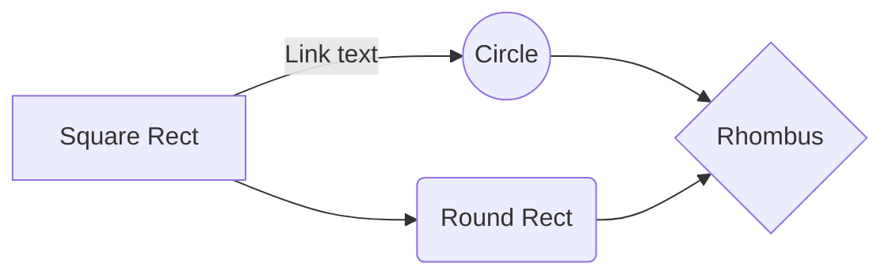

# Markdown Tricks

> A collection of Github markdown tricks for writing kickass READMEs, Pull Requests & Comments.
>
> Markdown is Github's version of dress code — Make your first impression count.

<br/>

### Writing on GitHub

> [!NOTE]
> 
> You can structure the information shared on GitHub with [Various formatting options](https://docs.github.com/en/get-started/writing-on-github).

## Further reading

- [Get Start writing on GitHub](https://docs.github.com/en/get-started/writing-on-github/getting-started-with-writing-and-formatting-on-github/quickstart-for-writing-on-github)
- [About writing and formatting on GitHub](https://docs.github.com/en/get-started/writing-on-github/getting-started-with-writing-and-formatting-on-github/about-writing-and-formatting-on-github)
- [Writing Markdown for VitePress like a pro](./vitepress.md)
- [Working with advanced formatting](https://docs.github.com/en/get-started/writing-on-github/working-with-advanced-formatting)
- [Quickstart for writing on GitHub
](https://docs.github.com/en/get-started/writing-on-github/getting-started-with-writing-and-formatting-on-github/quickstart-for-writing-on-github)
- [markdown hacks](https://www.markdownguide.org/hacks/)
- [markdown basic-syntax](https://www.markdownguide.org/basic-syntax/)
- [GitHub Flavored Markdown Spec](https://github.github.com/gfm/)
- [flavoured markdown](https://docs.github.com/en/get-started/writing-on-github/)
- [markup engine](https://github.com/github/markup/)   
- [LaTeX Mathematics](https://en.wikibooks.org/wiki/LaTeX/Mathematics/)
- [By John Gruber](http://daringfireball.net/projects/markdown/)
- [Emoji cheat sheet](https://github.com/ikatyang/emoji-cheat-sheet/blob/master/README.md)  

<hr/><br/>

# Markdown Reference
Automatically generate _table of contents_ by checking the option here: Settings > Format > Markdown.

## H2 Header
### H3 header
#### H4 Header
##### H5 Header
###### H6 Header

<!-- --------------- -->

## Format Text

*Italic emphasis* , _Alternative italic emphasis_

**Bold emphasis** , __Alternative bold emphasis__

~~Strikethrough~~

Break line (two spaces at end of line)  

> Block quote

`Inline code`

```ruby
Code blocks
are
awesome
```

### Fenced code blocks
You can create fenced code blocks by placing triple backticks ` ``` ` before and after the code block. We recommend placing a blank line before and after code blocks to make the raw formatting easier to read

```
function test() {
  console.log("notice the blank line before this function?");
}
```


> [!TIP]
> To preserve your formatting within a list, make sure to indent non-fenced code blocks by eight spaces.

To display triple backticks in a fenced code block, wrap them inside quadruple backticks.

````
```
Look! You can see my backticks.
```
````


If you are frequently editing code snippets and tables, you may benefit from enabling a fixed-width font in all comment fields on GitHub. For more information, see [About writing and formatting on GitHub](https://docs.github.com/en/get-started/writing-on-github/getting-started-with-writing-and-formatting-on-github/about-writing-and-formatting-on-github#enabling-fixed-width-fonts-in-the-editor).

### Syntax highlighting
You can add an optional language identifier to enable syntax highlighting in your fenced code block.

Syntax highlighting changes the color and style of source code to make it easier to read.

For example, to syntax highlight Ruby code:

```ruby
require 'redcarpet'
markdown = Redcarpet.new("Hello World!")
puts markdown.to_html
```
This will display the code block with syntax highlighting:


> [!TIP]
> 
> When you create a fenced code block that you also want to have syntax highlighting on a GitHub Pages site, use lower-case language identifiers. For more information, see [About GitHub Pages and Jekyll](https://docs.github.com/en/pages/setting-up-a-github-pages-site-with-jekyll/about-github-pages-and-jekyll#syntax-highlighting).

We use [Linguist](https://github.com/github-linguist/linguist) to perform language detection and to select [third-party grammars](https://github.com/github-linguist/linguist/blob/main/vendor/README.md) for syntax highlighting. You can find out which keywords are valid in the [languages YAML](https://github.com/github-linguist/linguist/blob/main/lib/linguist/languages.yml) file.


<br/> 

<!-- --------------- -->
 
## Lists
### Ordered & unordered

* Unordered list
* ...with asterisk/star
* Test

- Another unordered list
- ...with hyphen/minus
- Test

1. Ordered list
2. Test
3. Test
4. Test

- Nested lists
    * Unordered nested list
    * Test
    * Test
    * Test
- Ordered nested list
    1. Test
    2. Test
    3. Test
    4. Test
- Double-nested unordered list
    - Test
    - Unordered
        - Test a
        - Test b
    - Ordered
        1. Test 1
        2. Test 2

### Checklist
* [ ] Salad
* [x] Potatoes

1. [x] Clean
2. [ ] Cook

<!-- --------------- -->

<hr/><br/>

## Creating Mermaid diagrams
Mermaid is a Markdown-inspired tool that renders text into diagrams. For example, Mermaid can render flow charts, sequence diagrams, pie charts and more. For more information, see the [Mermaid documentation.](https://mermaid-js.github.io/mermaid/#/)

To create a Mermaid diagram, add Mermaid syntax inside a fenced code block with the mermaid language identifier. For more information about creating code blocks, see Creating and [highlighting code blocks](https://docs.github.com/en/get-started/writing-on-github/working-with-advanced-formatting/creating-and-highlighting-code-blocks).

For example, you can create a flow chart by specifying values and arrows.

```
Here is a simple flow chart:

mermaid
graph LR
    A[Square Rect] -- Link text --> B((Circle))
    A --> C(Round Rect)
    B --> D{Rhombus}
    C --> D
```

Here are the rendered alerts: 



> [!NOTE]
> 
> You may observe errors if you run a third-party Mermaid plugin when using Mermaid syntax on GitHub.

Checking your version of Mermaid
To ensure GitHub supports your Mermaid syntax, check the Mermaid version currently in use.


```mermaid
  info
```

<br/>

## Creating a collapsed section

<br/> 

<details>
<summary>Tips for collapsed sections</summary>
 
You can temporarily obscure sections of your Markdown by creating a collapsed section that the reader can choose to expand. For example, when you want to include technical details in an issue comment that may not be relevant or interesting to every reader, you can put those details in a collapsed section.
</details>

<br/> 

Any Markdown within the `<details>` block will be collapsed until the reader clicks  to expand the details.

Within the `<details>` block, use the `<summary>` tag to let readers know what is inside. The label appears to the right of: 

```
<details>

<summary>Tips for collapsed sections</summary>

### You can add a header

You can add text within a collapsed section.

You can add an image or a code block, too.

```ruby
   puts "Hello World"

</details>
```

The Markdown inside the `<summary>` label will be collapsed by default:


After a reader clicks, the details are expanded:


Optionally, to make the section display as open by default, add the `open` attribute to the `<details>` tag:

`<details open>`

<br><br/> 

## Links

You can create an inline link by wrapping link text in brackets `[ ]`, and then wrapping the URL in parentheses `( )`. You can also use the keyboard shortcut `Command+K` to create a link. When you have text selected, you can paste a URL from your clipboard to automatically create a link from the selection.

You can also create a Markdown hyperlink by highlighting the text and using the keyboard shortcut `Command+V`. If you'd like to replace the text with the link, use the keyboard shortcut `Command+Shift+V`.

This site was built using [GitHub Pages](https://pages.github.com/).

[Link](https://duckduckgo.com/)

[File in same folder as the document.](markor-markdown-reference.md) Use %20 for spaces!

<hr/><br>

### Section links

You can link directly to any section that has a heading. To view the automatically generated anchor in a rendered file, hover over the section heading to expose the  icon and click the 🔗 icon to display the anchor in your browser.

Screenshot of a README for a repository. To the left of a section heading, a link icon is outlined in dark orange.


If you need to determine the anchor for a heading in a file you are editing, you can use the following basic rules:

Letters are converted to lower-case.
Spaces are replaced by hyphens `(-)`. Any other whitespace or punctuation characters are removed.
Leading and trailing whitespace are removed.
Markup formatting is removed, leaving only the contents (for example, `_italics_` becomes `italics`).
If the automatically generated anchor for a heading is identical to an earlier anchor in the same document, a unique identifier is generated by appending a hyphen and an auto-incrementing integer.
For more detailed information on the requirements of URI fragments, see [RFC 3986: Uniform Resource Identifier (URI): Generic Syntax, Section 3.5.](https://www.rfc-editor.org/rfc/rfc3986#section-3.5)

The code block below demonstrates the basic rules used to generate anchors from headings in rendered content.

```
# Example headings

## Sample Section

## This'll be a _Helpful_ Section About the Greek Letter Θ!
A heading containing characters not allowed in fragments, UTF-8 characters, two consecutive spaces between the first and second words, and formatting.

## This heading is not unique in the file

TEXT 1

## This heading is not unique in the file

TEXT 2

# Links to the example headings above

Link to the sample section: [Link Text](#sample-section).

Link to the helpful section: [Link Text](#thisll-be-a-helpful-section-about-the-greek-letter-Θ).

Link to the first non-unique section: [Link Text](#this-heading-is-not-unique-in-the-file).

Link to the second non-unique section: [Link Text](#this-heading-is-not-unique-in-the-file-1).
```

<br/> 

> [!NOTE]
>
> If you edit a heading, or if you change the order of headings with "identical" anchors, you will also need to update any links to those headings as the anchors will change.

### Relative links
You can define relative links and image paths in your rendered files to help readers navigate to other files in your repository.

A relative link is a link that is relative to the current file. For example, if you have a README file in root of your repository, and you have another file in docs/CONTRIBUTING.md, the relative link to CONTRIBUTING.md in your README might look like this:

```
[Contribution guidelines for this project](docs/CONTRIBUTING.md)
```

GitHub will automatically transform your relative link or image path based on whatever branch you're currently on, so that the link or path always works. The path of the link will be relative to the current file. Links starting with `/` will be relative to the repository root. You can use all relative link operands, such as `./` and `../.`

Your link text should be on a single line. The example below will not work.

```
[Contribution
guidelines for this project](docs/CONTRIBUTING.md)
```

Relative links are easier for users who clone your repository. Absolute links may not work in clones of your repository - we recommend using relative links to refer to other files within your repository.
<br/> 


### Custom anchors

> [!NOTE]
> 
> Custom anchors will not be included in the document outline/Table of Contents.

You can link to a custom anchor using the value of the `name` attribute you gave the anchor. The syntax is exactly the same as when you link to an anchor that is automatically generated for a heading.

For example:

```
# Section Heading

Some body text of this section.

<a name="my-custom-anchor-point"></a>
Some text I want to provide a direct link to, but which doesn't have its own heading.

(… more content…)

[A link to that custom anchor](#my-custom-anchor-point)
```

> [!TIP]
> Custom anchors are not considered by the automatic naming and numbering behavior of automatic heading links.

## Line breaks
If you're writing in issues, pull requests, or discussions in a repository, GitHub will render a line break automatically:

```
This example
Will span two lines
```

However, if you are writing in an .md file, the example above would render on one line without a line break. To create a line break in an .md file, you will need to include one of the following:

- Include two spaces at the end of the first line.

```
This example  
Will span two lines
```

- Include a backslash at the end of the first line.

```
This example\
Will span two lines
```

- Include an HTML single line break tag at the end of the first line.


```
This example<br/>
Will span two line
```

If you leave a blank line between two lines, both .md files and Markdown in issues, pull requests, and discussions will render the two lines separated by the blank line:

```
This example

Will have a blank line separating both lines
```

<br/> 

## Admonition Extension

The position of a footnote in your Markdown does not influence where the footnote will be rendered. You can write a footnote right after your reference to the footnote, and the footnote will still render at the bottom of the Markdown. Footnotes are not supported in wikis.

You can add footnotes to your content by using this bracket syntax:

```
Here is a simple footnote[^1].

A footnote can also have multiple lines[^2].

[^1]: My reference.
[^2]: To add line breaks within a footnote, prefix new lines with 2 spaces.
  This is a second line.
```

The footnote will render like this:


## Images

You can display an image by adding ! and wrapping the alt text in [ ]. Alt text is a short text equivalent of the information in the image. Then, wrap the link for the image in parentheses ().

``

**OR**

``

**output:**


**OR**

``


GitHub supports embedding images into your issues, pull requests, discussions, comments and `.md` files. You can display an image from your repository, add a link to an online image, or upload an image. For more information, see [Uploading assets.
](https://docs.github.com/en/get-started/writing-on-github/getting-started-with-writing-and-formatting-on-github/basic-writing-and-formatting-syntax#uploading-assets)

<br/> 

> [!NOTE]
> 
> When you want to display an image that is in your repository, use relative links instead of absolute links.

### logo 

```no-highlight
Here's our logo (hover to see the title text):

Inline-style: 


Reference-style: 
![alt text][logo]

[logo]: https://github.com/adam-p/markdown-here/raw/master/src/common/images/icon48.png "Logo Title Text 2"
```

Here's our logo (hover to see the title text):

Inline-style: 


Reference-style: 
![alt text][logo]

[logo]: https://github.com/adam-p/markdown-here/raw/master/src/common/images/icon48.png "Logo Title Text 2"

<br/> 

### Uploading assets
You can upload assets like images by dragging and dropping, selecting from a file browser, or pasting. You can upload assets to issues, pull requests, comments, and `.md` files in your repository.

Using emojis
You can add emoji to your writing by typing `:EMOJICODE:`, a colon followed by the name of the emoji.

`@octocat :+1: This PR looks great - it's ready to merge! :shipit:`


Screenshot of rendered GitHub Markdown showing how emoji codes for +1 and shipit render visually as emoji.

Typing `:` will bring up a list of suggested emoji. The list will filter as you type, so once you find the emoji you're looking for, press Tab or Enter to complete the highlighted result.

For a full list of available emoji and codes, see the [Emoji-Cheat-Sheet](https://github.com/ikatyang/emoji-cheat-sheet/blob/master/README.md).

<br/> 

<!-- --------------- -->

## Alerts

Alerts are a Markdown extension based on the blockquote syntax that you can use to emphasize critical information. On GitHub, they are displayed with distinctive colors and icons to indicate the significance of the content.

Use alerts only when they are crucial for user success and limit them to one or two per article to prevent overloading the reader. Additionally, you should avoid placing alerts consecutively. Alerts cannot be nested within other elements.

To add an alert, use a special blockquote line specifying the alert type, followed by the alert information in a standard blockquote. Five types of alerts are available:

```
> [!NOTE]
> Useful information that users should know, even when skimming content.

> [!TIP]
> Helpful advice for doing things better or more easily.

> [!IMPORTANT]
> Key information users need to know to achieve their goal.

> [!WARNING]
> Urgent info that needs immediate user attention to avoid problems.

> [!CAUTION]
> Advises about risks or negative outcomes of certain actions.
```

**Here are the rendered alerts:**

> [!NOTE]
> Useful information that users should know, even when skimming content.

> [!TIP]
> Helpful advice for doing things better or more easily.

> [!IMPORTANT]
> Key information users need to know to achieve their goal.

> [!WARNING]
> Urgent info that needs immediate user attention to avoid problems.

> [!CAUTION]
> Advises about risks or negative outcomes of certain actions.
Here are the rendered alerts:

<br/> 

## Tables

| Left aligned | Middle aligned | Right aligned |
| :--------------- | :------------------: | -----------------: |
| Test                 | Test                      | Test                    |
| Test                 | Test                      | Test                    |


Shorter | Table | Syntax
:---: | ---: | :---
Test | Test | Test
Test | Test | Test

<!-- Comment: Not visibile in view. Can also span across multiple lines. End with:-->

<!-- ------------- -->

## Math (KaTeX)
See [reference](https://katex.org/docs/supported.html) & [examples](https://github.com/waylonflinn/markdown-it-katex/blob/master/README.md). Enable by checking Math at Settings > Markdown.

### Math inline

$ I = frac V R $

### Math block

$$begin{array}{c} 
abla times vec{mathbf{B}} -, frac1c, frac{partialvec{mathbf{E}}}{partial t} & = frac{4pi}{c}vec{mathbf{j}} 
abla cdot vec{mathbf{E}} & = 4 pi rho \ 
abla times vec{mathbf{E}}, +, frac1c, frac{partialvec{mathbf{B}}}{partial t} & = vec{mathbf{0}} \ 
abla cdot vec{mathbf{B}} & = 0 end{array}$$


$$frac{k_t}{k_e} = sqrt{2}$$

<!-- ------------- -->

<hr/><br/> 

## Format Text - Text color


## Markdown tricks

```diff
+ this text is highlighted in green
- this text is highlighted in red
```

<pre>
```diff
+ this text is highlighted in green
- this text is highlighted in red
```
</pre>

---

```CSS
Some text in green! 123
```

<pre>
```CSS
Some text in green! 123
```
</pre>

---

```P4
Some text in blue! 123
```

```Mint
Some text in blue with additional keyword highlighting! 123
```

<pre>
```P4
Some text in blue! 123
```

```Mint
Some text in blue with additional keyword highlighting! 123
```
</pre>

---

```robots.txt
some text in light blue! 123
```

<pre>
```robots.txt
some text in light blue! 123
```
</pre>

---

```EBNF
Some text in purple! 123
```

```mupad
Some text in purple with additional keyword highlighting! 123
```

<pre>
```EBNF
Some text in purple! 123
```

```mupad
Some text in purple with additional keyword highlighting! 123
```
</pre>

---

```Mathematica
Some text in orange! 123
```

```REXX
Some text in orange with additional keyword highlighting! 123
```

```Nix
Some text in orange with additional keyword highlighting! 123
```

<pre>
```Mathematica
Some text in orange! 123
```

```REXX
Some text in orange with additional keyword highlighting! 123
```

```Nix
Some text in orange with additional keyword highlighting! 123
```
</pre>

---

```POV-Ray SDL
some text in red!
```

<pre>
```POV-Ray SDL
some text in red!
```
</pre>

---

```RobotFramework
Some text in light red! 123
```

<pre>
```RobotFramework
Some text in light red! 123
```
</pre>

---

```JSON
Some text highlighted in red! 123
```

<pre>
```JSON
Some text highlighted in red! 123
```
</pre>

## HTML tricks

<samp>Monospaced text</samp>

```
<samp>Monospaced text</samp>
```

---

<ins>Underlined text</ins>

```
<ins>Underlined text</ins>
```

---

<table><tr><td>Boxed text</td></tr></table>

```
<table><tr><td>Boxed text</td></tr></table>
```

<br/> 

### Text sub & superscript

<u>Underline</u>

The <sub>Subway</sub> sandwich was <sup>super</sup>

Super special characters: ⁰ ¹ ² ³ ⁴ ⁵ ⁶ ⁷ ⁸ ⁹ ⁺ ⁻ ⁼ ⁽ ⁾ ⁿ ™ ® ℠

### Text positioning
<div markdown='1' align='right'>

text on the **Right**

</div>

<div markdown='1' align='left'>

text on the **Left**

</div>

<div markdown='1' align='center'>

text in the **Center**  
(one empy line above and below  
required for Markdown support OR markdown='1')

</div>

**For text on rtl align:**

<div dir="ltr">
  
- این یک متن فارسی می‌باشد

</div>


```roby
<div dir="ltr">

این یک متن فارسی می‌باشد

</div>
```

<hr/><br/> 

### Block Text

<div markdown='1' style='text-align: justify; text-justify: inter-word;'>
lorem ipsum dolor sit amet, consetetur sadipscing elitr, sed diam nonumy eirmod tempor invidunt ut labore et dolore magna aliquyam erat, sed diam voluptua. At vero eos et accusam et justo duo dolores et ea rebum. 
</div>

<hr/><br/> 

### Break page
To break the page (/start a new page), put the div below into a own line.
Relevant for creating printable pages from the document (Print / PDF).

<div style='page-break-after: always'></div>


<!-- ------------- -->

## Videos


> [!NOTE]
>
> Github Markdown cannot render this type of video, Audio and diagrams.
>
> So, just for fun ...

```
**Youtube** [Welcome to Upper Austria](https://www.youtube.com/watch?v=RJREFH7Lmm8)
<iframe width='360' height='200' src='https://www.youtube.com/embed/RJREFH7Lmm8'> </iframe>


-----------------------------------


**Peertube** [Road in the wood](https://open.tube/videos/watch/8116312a-dbbd-43a3-9260-9ea6367c72fc)
<div><video controls><source src='https://peertube.mastodon.host/download/videos/8116312a-dbbd-43a3-9260-9ea6367c72fc-480.mp4' </source></video></div>

-----------------------------------

<!-- **Local video** <div><video controls><source src='voice-parrot.mp4' </source></video></div> -->
```

```
### Audio & Music
**Web audio** [Guifrog - Xia Yu](https://www.freemusic.org/music/Guifrog/Xia_Yu)
<audio controls src='https://files.freemusic.org/storage/music/Guifrog_-_Xia_Yu.mp3'></audio>

-----------------------------------

**Local audio** Yellowcard - Lights up in the sky
<audio controls src='../Music/mp3/Yellowcard/[2007]PaperWalls/Yellowcard-2005-LightUptheSky.mp3'></audio>
```
<hr/><br>

## Links

There are two ways to create links.

```no-highlight
[I'm an inline-style link](https://www.google.com)

[I'm a reference-style link][Arbitrary case-insensitive reference text]

[You can use numbers for reference-style link definitions][1]

Or leave it empty and use the [link text itself]

URLs and URLs in angle brackets will automatically get turned into links. 
http://www.example.com or <http://www.example.com> and sometimes 
example.com (but not on Github, for example).

Some text to show that the reference links can follow later.

[arbitrary case-insensitive reference text]: https://www.mozilla.org
[1]: http://slashdot.org
[link text itself]: http://www.reddit.com
```

[I'm an inline-style link](https://www.google.com)

[I'm a reference-style link][Arbitrary case-insensitive reference text]

[You can use numbers for reference-style link definitions][1]

Or leave it empty and use the [link text itself]

URLs and URLs in angle brackets will automatically get turned into links. 
http://www.example.com or <http://www.example.com> and sometimes 
example.com (but not on Github, for example).

Some text to show that the reference links can follow later.

[arbitrary case-insensitive reference text]: https://www.mozilla.org
[1]: http://slashdot.org
[link text itself]: http://www.reddit.com

<a name="images"/>

<a name="code"/>

## Code and Syntax Highlighting

Code blocks are part of the Markdown spec, but syntax highlighting isn't. However, many renderers -- like Github's and *Markdown Here* -- support syntax highlighting. *Markdown Here* supports highlighting for dozens of languages (and not-really-languages, like diffs and HTTP headers); to see the complete list, and how to write the language names, see the [highlight.js demo page](http://softwaremaniacs.org/media/soft/highlight/test.html).

```no-highlight
Inline `code` has `back-ticks around` it.
```

Inline `code` has `back-ticks around` it.

Blocks of code are either fenced by lines with three back-ticks <code>```</code>, or are indented with four spaces. I recommend only using the fenced code blocks -- they're easier and only they support syntax highlighting.

<pre lang="no-highlight"><code>```javascript
var s = "JavaScript syntax highlighting";
alert(s);
```
 
```python
s = "Python syntax highlighting"
print s
```
 
```
No language indicated, so no syntax highlighting. 
But let's throw in a &lt;b&gt;tag&lt;/b&gt;.
```
</code></pre>


```javascript
var s = "JavaScript syntax highlighting";
alert(s);
```

```python
s = "Python syntax highlighting"
print s
```

```
No language indicated, so no syntax highlighting in Markdown Here (varies on Github). 
But let's throw in a <b>tag</b>.
```

Again, to see what languages are available for highlighting, and how to write those language names, see the [highlight.js demo page](http://softwaremaniacs.org/media/soft/highlight/test.html).


<a name="blockquotes"/>

## Blockquotes

```no-highlight
> Blockquotes are very handy in email to emulate reply text.
> This line is part of the same quote.

Quote break.

> This is a very long line that will still be quoted properly when it wraps. Oh boy let's keep writing to make sure this is long enough to actually wrap for everyone. Oh, you can *put* **Markdown** into a blockquote. 
```

> Blockquotes are very handy in email to emulate reply text.
> This line is part of the same quote.

Quote break.

> This is a very long line that will still be quoted properly when it wraps. Oh boy let's keep writing to make sure this is long enough to actually wrap for everyone. Oh, you can *put* **Markdown** into a blockquote. 

<a name="html"/>

## Inline HTML

You can also use raw HTML in your Markdown, and it'll mostly work pretty well. 

```no-highlight
<dl>
  <dt>Definition list</dt>
  <dd>Is something people use sometimes.</dd>

  <dt>Markdown in HTML</dt>
  <dd>Does *not* work **very** well. Use HTML <em>tags</em>.</dd>
</dl>
```

<dl>
  <dt>Definition list</dt>
  <dd>Is something people use sometimes.</dd>

  <dt>Markdown in HTML</dt>
  <dd>Does *not* work **very** well. Use HTML <em>tags</em>.</dd>
</dl>

<a name="hr"/>

## Horizontal Rule

```
Three or more...

---

Hyphens

***

Asterisks

___

Underscores
```

Three or more...

---

Hyphens

***

Asterisks

___

Underscores

<a name="lines"/>

## Line Breaks

My basic recommendation for learning how line breaks work is to experiment and discover -- hit &lt;Enter&gt; once (i.e., insert one newline), then hit it twice (i.e., insert two newlines), see what happens. You'll soon learn to get what you want. "Markdown Toggle" is your friend. 

Here are some things to try out:

```
Here's a line for us to start with.

This line is separated from the one above by two newlines, so it will be a *separate paragraph*.

This line is also a separate paragraph, but...
This line is only separated by a single newline, so it's a separate line in the *same paragraph*.
```

Here's a line for us to start with.

This line is separated from the one above by two newlines, so it will be a *separate paragraph*.

This line is also begins a separate paragraph, but...  
This line is only separated by a single newline, so it's a separate line in the *same paragraph*.

(Technical note: *Markdown Here* uses GFM line breaks, so there's no need to use MD's two-space line breaks.)

<a name="videos"/>

## YouTube Videos

They can't be added directly but you can add an image with a link to the video like this:

```no-highlight
<a href="http://www.youtube.com/watch?feature=player_embedded&v=YOUTUBE_VIDEO_ID_HERE
" target="_blank"></a>
```

Or, in pure Markdown, but losing the image sizing and border:

```no-highlight
[](http://www.youtube.com/watch?v=YOUTUBE_VIDEO_ID_HERE)
```

<a name="tex"/>

## TeX Mathematical Formulae

A full description of TeX math symbols is beyond the scope of this cheatsheet. Here's a [good reference](https://en.wikibooks.org/wiki/LaTeX/Mathematics), and you can try stuff out on [CodeCogs](https://www.codecogs.com/latex/eqneditor.php). You can also play with formulae in the Markdown Here options page.

Here are some examples to try out:

```
$-b \pm \sqrt{b^2 - 4ac} \over 2a$
$x = a_0 + \frac{1}{a_1 + \frac{1}{a_2 + \frac{1}{a_3 + a_4}}}$
$\forall x \in X, \quad \exists y \leq \epsilon$
```

The beginning and ending dollar signs (`$`) are the delimiters for the TeX markup.
    
<hr/><br/>


## Further reading

- [Get Start writing on GitHub](https://docs.github.com/en/get-started/writing-on-github/getting-started-with-writing-and-formatting-on-github/quickstart-for-writing-on-github)
- [Emoji cheat sheet](https://github.com/ikatyang/emoji-cheat-sheet/blob/master/README.md)
- [README-Full.md](README-Full.md) for some common page elements.
- [GitHub Flavored Markdown Spec](https://github.github.com/gfm/)
- [About writing and formatting on GitHub](https://docs.github.com/en/get-started/writing-on-github/getting-started-with-writing-and-formatting-on-github/about-writing-and-formatting-on-github)
- [Working with advanced formatting](https://docs.github.com/en/get-started/writing-on-github/working-with-advanced-formatting)
- [Quickstart for writing on GitHub
](https://docs.github.com/en/get-started/writing-on-github/getting-started-with-writing-and-formatting-on-github/quickstart-for-writing-on-github)
